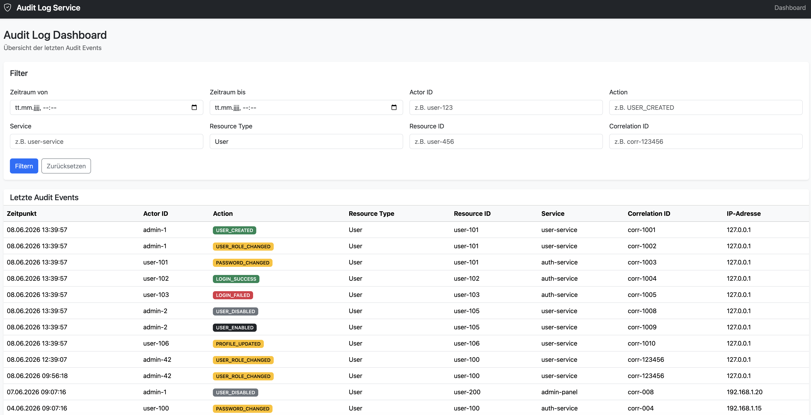

# Audit Log Service

Ein zentraler Audit-Log-Microservice auf Basis von Symfony zur Nachverfolgung von Benutzer- und Systemaktionen in verteilten Anwendungen.

Der Service speichert Audit-Events unveränderbar, unterstützt Filterung und Pagination und ermöglicht die Nachverfolgung von Geschäftsprozessen über Correlation IDs.

---

# Motivation

In modernen Anwendungen und Microservice-Architekturen werden täglich zahlreiche sicherheits- und geschäftsrelevante Aktionen ausgeführt:

- Benutzer anlegen

- Rollen ändern

- Passwörter zurücksetzen

- Bestellungen erstellen

- Zahlungen verarbeiten

- API-Schlüssel erzeugen

- Daten exportieren

Der Audit Log Service beantwortet dabei zentrale Fragen:

- Wer hat eine Aktion ausgeführt?

- Was wurde getan?

- Wann ist die Aktion erfolgt?

- Welcher Service war beteiligt?

- Zu welchem Geschäftsprozess gehörte die Aktion?

---

# Features

- Audit-Events über REST API erfassen

- Unveränderbare Speicherung (keine Updates oder Löschungen)

- Flexible Filtermöglichkeiten

- Pagination

- Unterstützung von Correlation IDs

- JSON-Metadaten für zusätzliche Informationen

- API-Key-Authentifizierung

- Mariadb als Datenspeicher

- DTO-basierte Request-Validierung

- Docker-Unterstützung

---

# Architektur

```text

                    ┌─────────────────────┐

                    │  Audit Log Service  │

                    │        MySQL        │

                    └────────▲────────────┘

                             │

                             │ Audit Events

                             │

      ┌─────────────┬────────┴─────────┬─────────────┐

      │             │                  │             │

      ▲             ▲                  ▲             ▲

┌──────────┐  ┌─────────────┐  ┌────────────┐  ┌────────────┐

│ User Svc │  │ Order Svc   │  │ BillingSvc │  │ AdminPanel │

└──────────┘  └─────────────┘  └────────────┘  └────────────┘

```

Jeder Service sendet relevante Ereignisse an den Audit Log Service, der diese zentral speichert.

---

# Audit Event

Beispiel eines Audit-Events:

```json

{

  "actorId": "admin-42",

  "action": "USER_ROLE_CHANGED",

  "resourceType": "User",

  "resourceId": "user-100",

  "serviceName": "user-service",

  "correlationId": "corr-123456",

  "metadata": {

    "oldRole": "USER",

    "newRole": "ADMIN"

  }

}

```

---

# Correlation IDs

Correlation IDs ermöglichen die Nachverfolgung eines gesamten Geschäftsprozesses über mehrere Services hinweg.

Beispiel:

```text

Frontend

    │

    ▼

Order Service

    │

    ▼

Payment Service

    │

    ▼

Inventory Service

    │

    ▼

Notification Service

```

Alle beteiligten Services verwenden dieselbe Correlation ID:

```text

corr-order-4711

```

Dadurch kann später die komplette Verarbeitung einer Bestellung nachvollzogen werden:

```text

ORDER_CREATED

PAYMENT_RECEIVED

STOCK_RESERVED

EMAIL_SENT

```

---

# API

## Audit Event erstellen

```http

POST /api/audit-events

```

Beispiel:

```bash

curl -X POST http://localhost:8001/api/audit-events \

  -H "Content-Type: application/json" \

  -H "X-API-Key: dev-secret" \

  -d '{

    "actorId": "admin-42",

    "action": "USER_ROLE_CHANGED",

    "resourceType": "User",

    "resourceId": "user-100",

    "serviceName": "user-service",

    "correlationId": "corr-123456",

    "metadata": {

      "oldRole": "USER",

      "newRole": "ADMIN"

    }

  }'

```

## Audit Events abrufen

```http

GET /api/audit-events

```

Unterstützte Filter:

```text

actorId

action

resourceType

resourceId

serviceName

correlationId

from

to

page

limit

```

Beispiele:

```http

GET /api/audit-events?action=USER_CREATED

```

```http

GET /api/audit-events?correlationId=corr-order-4711

```

## Einzelnes Audit Event abrufen

```http

GET /api/audit-events/{id}

```

---

# Datenmodell

```text

AuditEvent

-----------

id

actorId

action

resourceType

resourceId

serviceName

correlationId

metadata

ipAddress

userAgent

createdAt

```

---

# Dashboard

Zusätzlich zur REST API verfügt das Projekt über ein einfaches webbasiertes Dashboard zur Visualisierung und Analyse der Audit-Events.

Das Dashboard ermöglicht:

- Anzeige der neuesten Audit-Events

- Filterung nach:

  - Actor ID

  - Action

  - Resource Type

  - Resource ID

  - Service Name

  - Correlation ID

  - Zeitraum

- Pagination

- Farbige Hervorhebung verschiedener Event-Typen

- Schnelle Analyse von Benutzer- und Systemaktivitäten

## Screenshot



### Technische Umsetzung

Das Dashboard wurde mit folgenden Technologien umgesetzt:

- Symfony Controller

- Twig Templates

- Bootstrap 5

- Doctrine ORM

- Filter-DTOs

- Repository Pattern

Ziel des Dashboards ist es, Audit-Daten ohne zusätzliche Tools wie Kibana oder Grafana direkt innerhalb der Anwendung analysieren zu können.

---

# Technologie-Stack

- PHP 8.4

- Symfony 7

- Doctrine ORM

- MySQL

- Docker

- PHPUnit

- Symfony Validator

- DTO-basierte Request-Verarbeitung

---

# Lokale Entwicklung

Container starten:

```bash

docker compose up -d

```

Migrationen ausführen:

```bash

php bin/console doctrine:migrations:migrate

```

Symfony starten:

```bash

symfony serve

```

---

# Sicherheit

Die API wird über API-Keys abgesichert.

Beispiel:

```http

X-API-Key: dev-secret

```

---

# Lernziele des Projekts

Dieses Projekt dient als Demonstration folgender Technologien und Konzepte:

- REST API Design

- Symfony 7

- DTO-basierte Request-Verarbeitung

- Request Validation

- Doctrine ORM

- Repository Pattern

- Pagination

- API-Key Authentication

- Docker

- MySQL

- Microservice-Kommunikation

- Correlation IDs

- Audit Logging

- Clean Code Prinzipien

---

# Roadmap

Geplante Erweiterungen:

- Symfony Messenger

- RabbitMQ Integration

- CSV-Export

- OpenAPI / Swagger Dokumentation

- Redis Caching

- Rate Limiting

- Dashboard für Audit-Auswertungen

- Elasticsearch/OpenSearch Integration

- Event-Retention und Archivierung

---

# Lizenz

MIT License